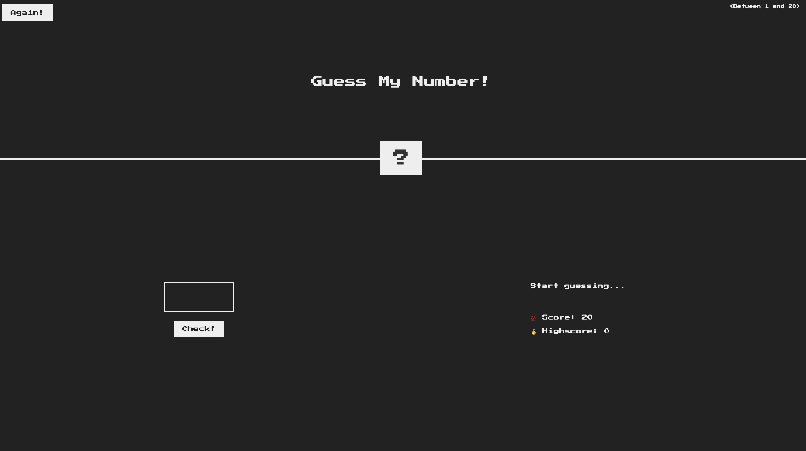
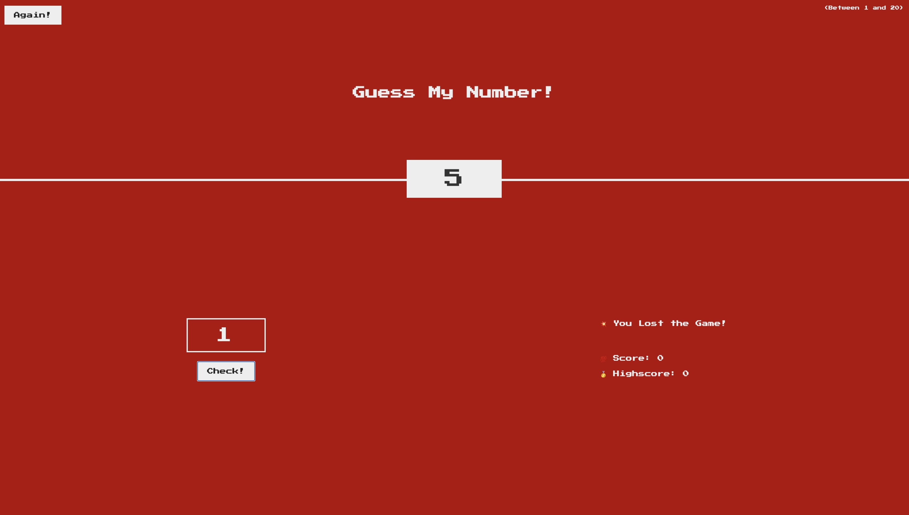
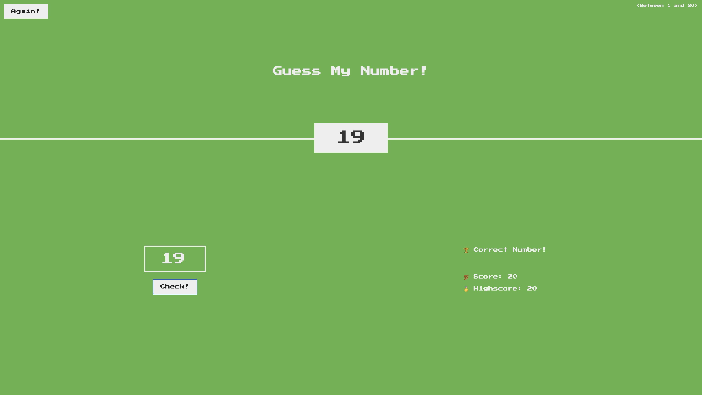

# Guess My Number

This is a retro-inspired game that challenges the player to guess a randomnly generated secret number between 1 and 20. The player has 20 attempts to win and the high score of each round is logged if the player chooses to play again.

## Table of contents

- [Overview](#overview)
  - [Screenshots](#screenshots)
  - [Links](#links)
- [My process](#my-process)
  - [Built with](#built-with)
  - [What I learned](#what-i-learned)
  - [Continued development](#continued-development)
- [Author](#author)

## Overview

### Screenshots

### Links

- Live Site URL: (https://mcddcm.github.io/guess-my-number/)

## My process

### Built with

- JavaScript
- Semantic HTML5 markup
- CSS custom properties

### What I learned

The focus of this project was to practice using JavaScript for DOM manipulation with eventListener and event handler functions, and code refactoring

### Continued development

Future JavaScript projects will focus on making code more extensible allowing for better user interaction (for example, allowing the player to submit a guess when the Enter key is pressed) and modification of CSS styles.

## Author

- Github - [@mcddcm](https://github.com/mcddcm)
